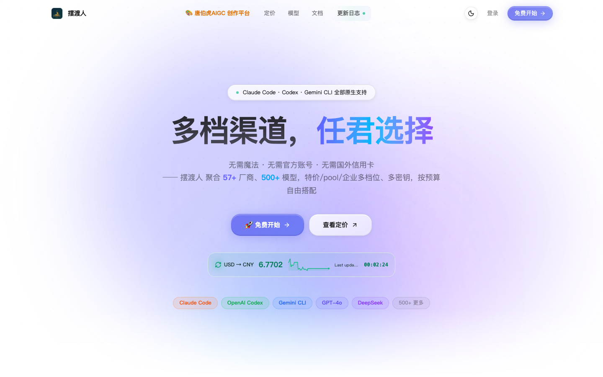
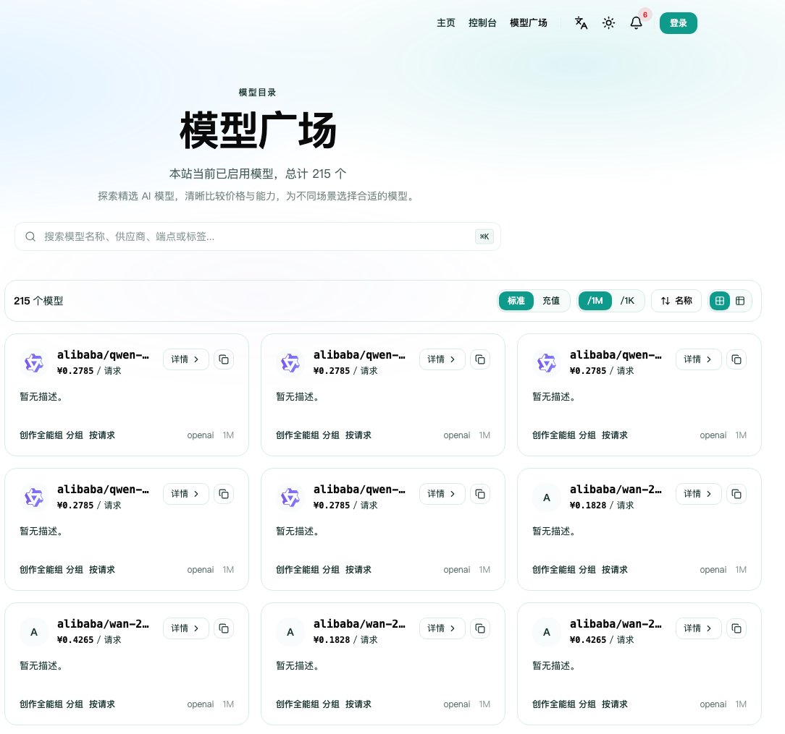
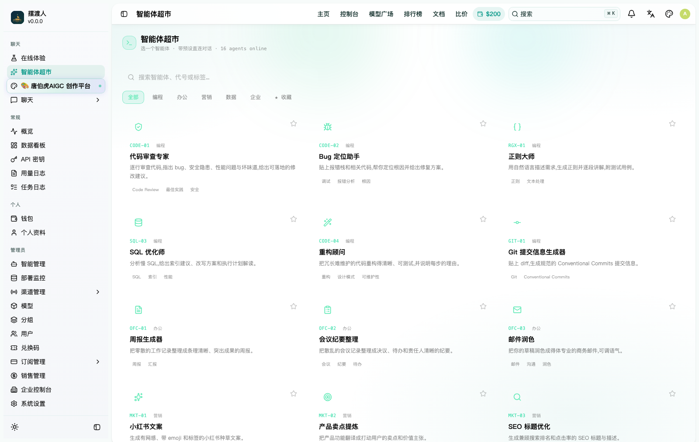
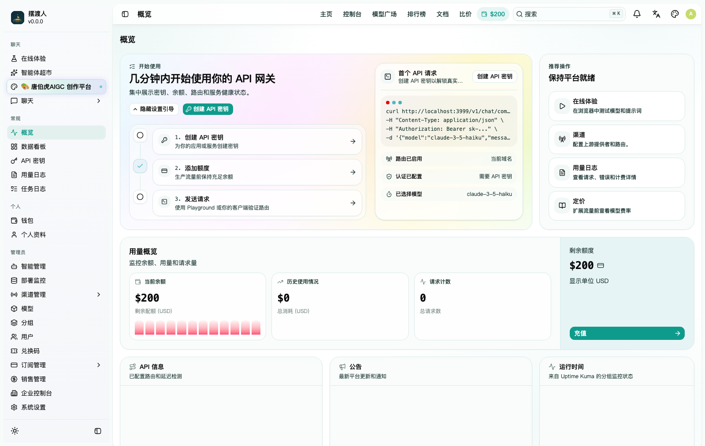
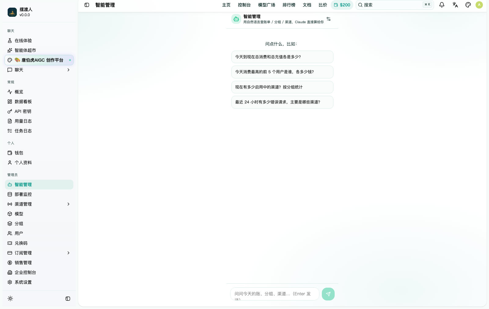
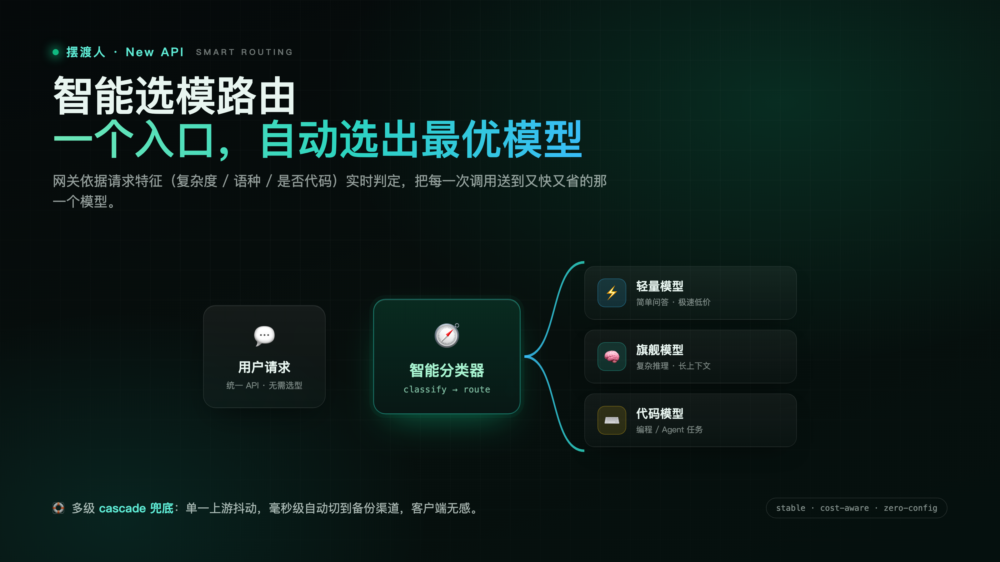
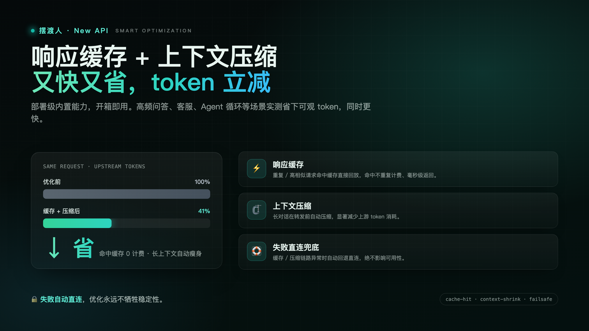
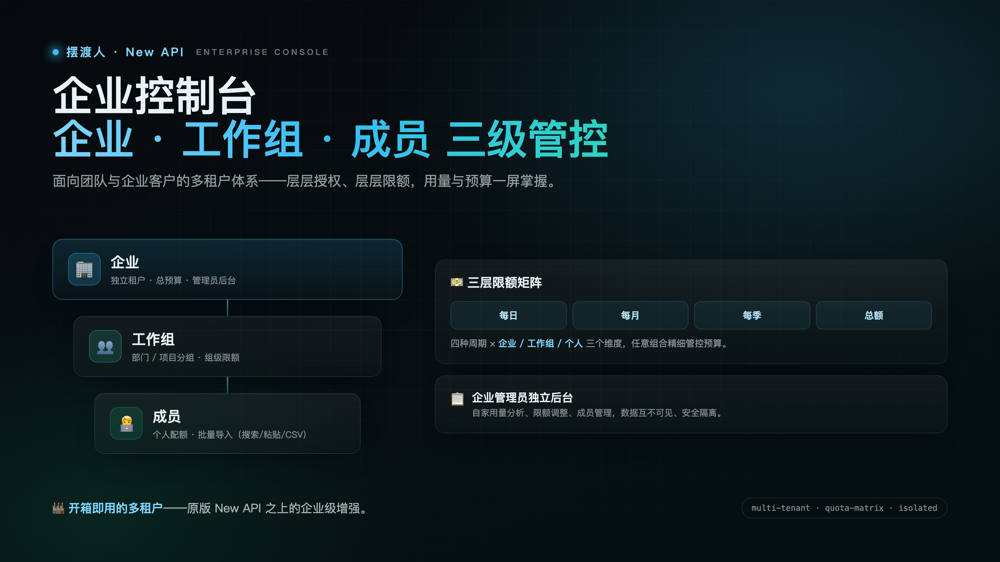
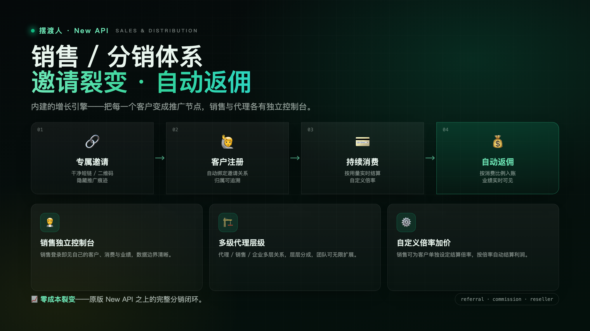

<div align="center">

# 摆渡人 · New API

**下一代 AI 模型网关与聚合平台** — 一个接口，接住所有大模型

[](./LICENSE)
[](https://go.dev/)
[](https://react.dev/)
[](./docker-compose.yml)
[](#-贡献)

*Built on [New API](https://github.com/QuantumNous/new-api) by QuantumNous*

</div>

---

## ✨ 这是什么

**摆渡人 · New API** 是在开源项目 [New API](https://github.com/QuantumNous/new-api) 之上深度增强的 AI 模型网关。它把 40+ 上游大模型（OpenAI / Claude / Gemini / 国产全家族等）聚合到**统一的 OpenAI 兼容接口**背后，并叠加了一整套面向真实商业运营的能力：智能选模、订阅套餐、缓存降本、智能体超市、视频创作与 AI 后台管理。

> 一句话：**给你的用户一个稳、快、省的统一大模型入口；给你自己一套开箱即用的运营中台。**

---

## 🚀 核心亮点

### 🧠 智能选模路由
用户不用纠结用哪个模型——网关按请求特征（难度 / 语种 / 是否代码）自动选出**又快又省**的最佳模型，简单问题走轻量模型、复杂任务走旗舰模型，兜底永不掉链子。

### ⚡ 内置响应缓存 + 智能压缩
平台级的**响应缓存**与**上下文智能压缩**：重复/相似请求命中缓存直接回放、长上下文自动压缩，**显著降低上游成本、提升响应速度**——高频场景实测可省下大头 token 开销。*（部署级特性，开箱可用）*

### 🎫 订阅套餐系统
内置多档**订阅制**（锁模型 / 额度池 / 有效期），一键把「按量计费」升级成「包月套餐」，配套购买页、额度看板、自动续费与粘性会话。

### 🤖 智能体超市
上架即用的 **Agent 市场**（编程 / 办公 / 营销 / 数据 / 企业分类）：选商品 → 填需求 → 带预设 System Prompt 直接进 Playground 对话。

### 🎬 Seedance 视频创作
集成文生视频 / 图生视频工作台，多分辨率、多入口，创作与 API 一体。

### 🛡️ AI 后台管理（Copilot）
后台「智能管理」——用**自然语言查账、看用量、管渠道**，只读 SQL 守卫下的 AI 助手，手机上也能运维。

### 🔌 强大的聚合底座（继承自 New API）
- 40+ 上游 Provider 适配（OpenAI / Claude / Gemini / Azure / Bedrock / Vertex / 国产…）
- 统一计费、额度、令牌、分组倍率、速率限制
- 多种鉴权：JWT / Passkey / OAuth（GitHub / Discord / OIDC…）
- 完善的管理后台与数据看板 · 多语言 i18n

---

## 🖼️ 产品一览（从首页开始走一遍）

> 完整功能说明见 **[功能文档 · FEATURES.md](./docs/FEATURES.md)**

### 1️⃣ 首页 · 一眼看懂
57+ 厂商、500+ 模型，特价 / pool / 企业多档位，按预算自由搭配，无需魔法、无需国外信用卡。



### 2️⃣ 模型广场 · 清晰比价
215+ 在售模型，按分组 / 供应商 / 标签筛选，价格与能力一目了然。



### 3️⃣ 智能体超市 · 选个 Agent 直接用
编程 / 办公 / 营销 / 数据 / 企业分类，带预设 System Prompt 一键进 Playground 对话。



### 4️⃣ 控制台 · 密钥 / 余额 / 用量一屏掌握
几分钟跑通第一个请求，密钥、额度、路由与服务健康状态集中展示。



### 5️⃣ 后台智能管理 · 自然语言运维
用大白话查账、看用量、管渠道——AI Copilot 直接算给你。



> 更多功能截图（订阅套餐 / 渠道纯血度 / 健康监控 / 探针…）见 **[功能文档 · FEATURES.md](./docs/FEATURES.md)**。

---

## ⚡ 核心能力 · 相对原版 New API 的差异化

这几块是纯后端 / 平台能力，看图更直观：

### 🧭 智能选模路由 · 一个入口自动选最优模型
依据请求特征（复杂度 / 语种 / 是否代码）实时判定，把每次调用送到又快又省的模型，多级 cascade 兜底。



### ⚡ 响应缓存 + 上下文压缩 · 又快又省
命中缓存毫秒返回、不重复计费；长上下文自动压缩省 token；失败自动直连不牺牲稳定性。



### 🏢 企业控制台 · 企业 / 工作组 / 成员 三级管控
面向团队的多租户体系：三级架构 + 四周期 × 三维度限额矩阵 + 企业管理员独立后台，租户间数据隔离。



### 📈 销售 / 分销体系 · 邀请裂变 + 自动返佣
把每个客户变成推广节点：专属邀请 → 自动绑定 → 持续消费 → 按比例返佣，销售 / 代理各有独立控制台。



---

## 🏁 快速开始

### Docker Compose（推荐）

```bash
git clone https://github.com/lsh4ck/new-api-baiduren.git
cd new-api-baiduren
cp .env.example .env          # 按需填写配置
docker compose up -d
```

启动后访问 `http://localhost:3000`，默认管理员账号见首次启动日志。

> ⚠️ 生产部署前请务必修改 `docker-compose.yml` 中的所有 `CHANGE_ME` 占位密钥（SESSION_SECRET / 数据库密码 / OAuth secret 等）。

### 从源码构建

```bash
# 后端
go build -o new-api .

# 前端
cd web/default && bun install && bun run build
```

---

## 🧱 技术栈

| 层 | 技术 |
|---|---|
| 后端 | Go 1.22+ · Gin · GORM v2 |
| 前端 | React 19 · TypeScript · Rsbuild · Tailwind CSS |
| 数据库 | SQLite / MySQL / PostgreSQL |
| 缓存 | Redis + 内存缓存 |
| 部署 | Docker · Docker Compose |

---

## 🙏 致谢与署名

本项目基于优秀的开源项目 **[New API](https://github.com/QuantumNous/new-api)**（作者 **QuantumNous**）构建，在其之上做了产品化增强。核心网关能力归功于上游项目，遵循其开源许可协议。

---

## 📄 许可

本项目遵循 **[AGPL-3.0](./LICENSE)** 许可（与上游 New API 一致）。这意味着若你基于本项目提供网络服务，需按 AGPL 要求开放你的修改源码。使用中请保留 New API / QuantumNous 的相关署名与版权声明。

---

<div align="center">

**摆渡人** · 让每一次大模型调用都又稳又省
[apiai.xin](https://apiai.xin)

</div>
