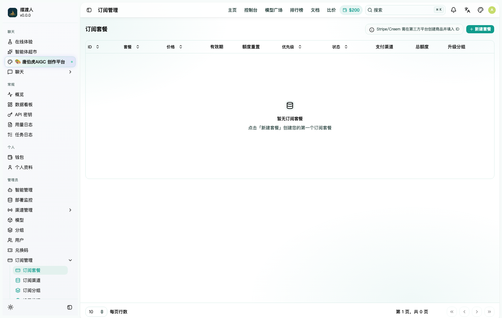
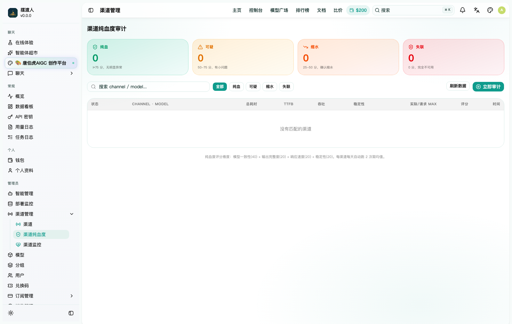
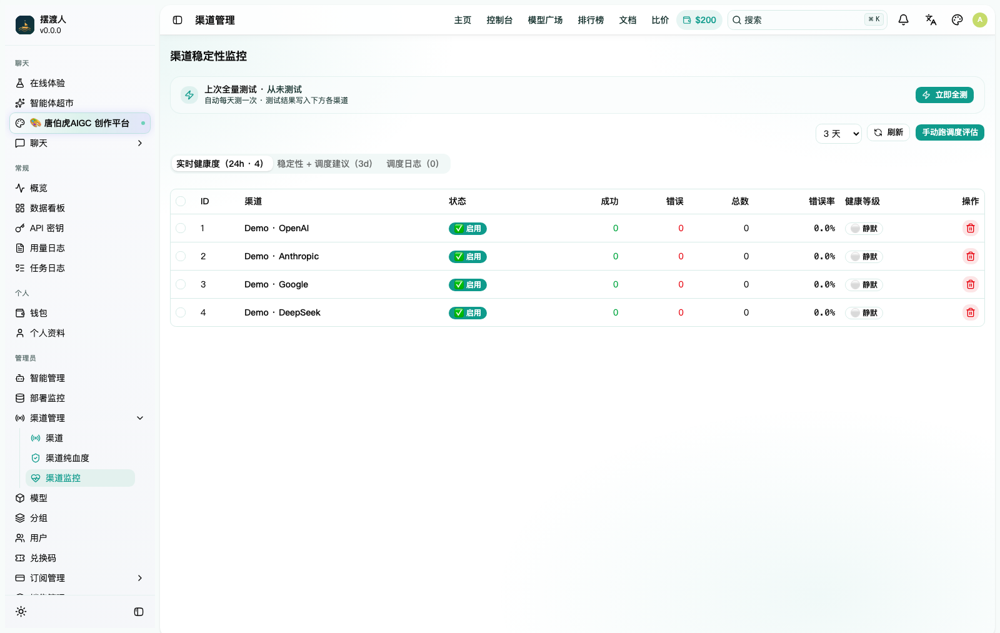
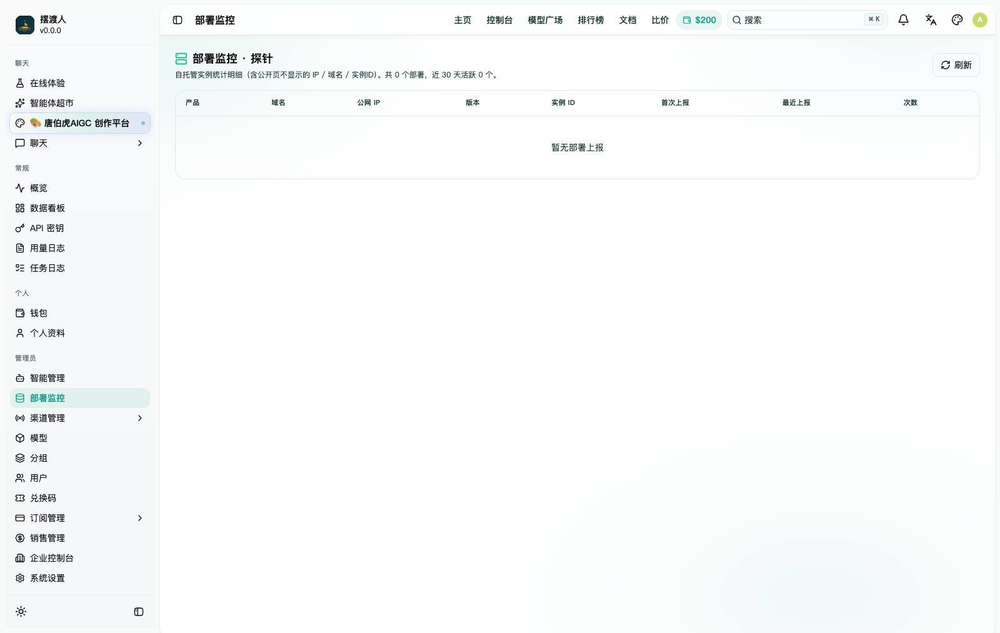
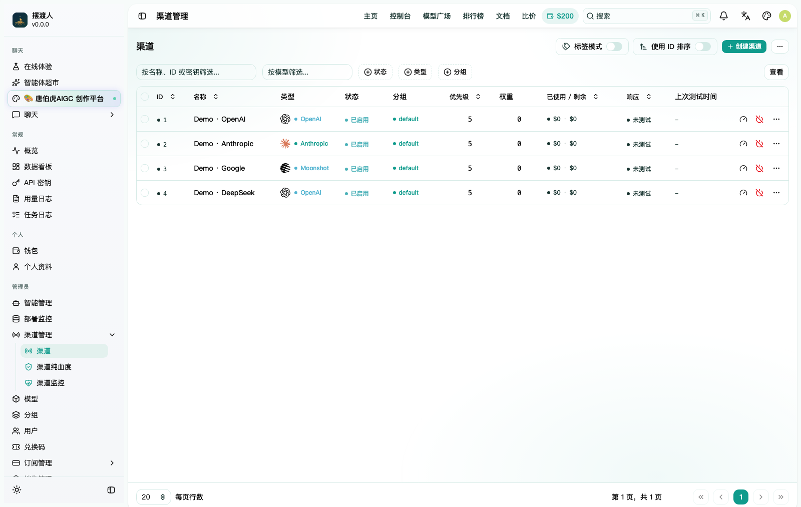

# 功能文档 · 摆渡人 · New API

本文档介绍 **摆渡人 · New API** 在开源项目 [New API](https://github.com/QuantumNous/new-api) 基础上增强的**全部功能**，每个功能配有真实界面截图或功能示意图。基础网关能力（多渠道聚合、计费、令牌、鉴权）见上游 New API 文档，本文聚焦增强特性。

> 界面截图取自全新部署的干净实例（演示数据）；技术能力配功能示意图。演示站点：[apiai.xin](https://apiai.xin)

---

## 目录

- [1. 智能选模路由](#1-智能选模路由)
- [2. 响应缓存 + 智能压缩](#2-响应缓存--智能压缩)
- [3. 订阅套餐系统](#3-订阅套餐系统)
- [4. 智能体超市](#4-智能体超市)
- [5. Seedance 视频创作](#5-seedance-视频创作)
- [6. 后台智能管理（AI Copilot）](#6-后台智能管理ai-copilot)
- [7. 渠道纯血度审计](#7-渠道纯血度审计)
- [8. 渠道健康监控与自动容灾](#8-渠道健康监控与自动容灾)
- [9. 分档分组定价](#9-分档分组定价)
- [10. 企业控制台](#10-企业控制台)
- [11. 销售 / 分销体系](#11-销售--分销体系)
- [12. 部署自托管探针](#12-部署自托管探针)

> **相对原版 New API 的差异化优势板块**：`智能选模路由` · `响应缓存 + 压缩` · `订阅套餐` · `智能体超市` · `后台 AI Copilot` · `渠道纯血度审计` · `企业控制台` · `销售 / 分销体系`。

---

## 控制台总览

集中展示密钥、余额、路由与服务健康状态，几分钟内跑通第一个请求。

---

## 1. 智能选模路由

用户无需纠结"该用哪个模型"。开启智能选模后，网关依据请求特征（复杂度、语种、是否代码）**自动选出又快又省的最佳模型**：简单问答走轻量模型、复杂推理与代码走旗舰模型，并内置多级兜底——单一上游抖动时自动 cascade 到备份渠道。

- 对客户：一个"智能"入口，体验稳定、成本可控。
- 对运营：把高价模型的调用压到真正需要的请求上，显著降本。

---

## 2. 响应缓存 + 智能压缩

平台内置**响应缓存**与**上下文智能压缩**两项降本提速能力（部署级特性，开箱即用）：

- **响应缓存**：重复 / 高相似度请求命中缓存直接回放，命中不重复计费、毫秒级返回。
- **智能压缩**：长上下文在转发前自动压缩，减少上游 token 消耗。
- **失败直连兜底**：缓存 / 压缩链路异常时自动回退直连，绝不影响可用性。

高频问答、客服、Agent 循环等场景实测可省下可观的 token 开销，同时降低平均时延。

---

## 3. 订阅套餐系统

把"按量计费"升级为"包月订阅"，内置完整的套餐售卖闭环：

- **多档套餐**：锁定模型范围 + 独立额度池 + 有效期（如 体验 / 标准 / 旗舰 等档）。
- **购买页 & 额度看板**：客户自助下单、查看剩余额度与续费。
- **粘性会话**：订阅账号在会话级别保持一致，体验连续。
- **自动续费 & 到期管理**。

---

## 4. 智能体超市

上架即用的 **Agent 市场**，按 编程 / 办公 / 营销 / 数据 / 企业 分类：

- 卡片网格浏览 + 分类筛选 + 搜索 + 收藏。
- 点开详情看能力标签、指定模型、"怎么用效果更好"提示。
- 「立即使用」带着预设 System Prompt + 模型直接进 Playground 对话。

---

## 5. Seedance 视频创作

集成文生视频 / 图生视频工作台：多入口、多分辨率档位、任务队列 + 进度追踪 + 失败自动退款，创作与 API 一体。

---

## 6. 后台智能管理（AI Copilot）

后台「智能管理」是一个 **AI 运维助手**：用自然语言查账、看用量、管渠道。只读 SQL 守卫下的工具循环，手机后台也能自然语言运维。

---

## 7. 渠道纯血度审计

面向运营者的**渠道质量检测工具**：检测渠道返回的模型是否"纯血"（真实官方模型 vs 被替换 / 注水的模型），按 纯血 / 可疑 / 缩水 / 失联 四档评分，帮助甄别渠道质量。

---

## 8. 渠道健康监控与自动容灾

- **渠道监控面板**：实时健康度、成功率、时延、错误率。
- **自动禁用（auto-ban）**：渠道连续失败自动摘除，恢复后自动回归。
- **告警邮件**：渠道异常 / 恢复自动邮件通知管理员。

---

## 9. 分档分组定价

灵活的**分组倍率 + 分档**体系：每个模型可配 特价 / pool / 企业 等多档分组，不同倍率对应不同稳定性与价格；分组级 / 模型级倍率、缓存倍率、汇率均可配置，客户按预算在档位间自由搭配。

---

## 10. 企业控制台

面向团队与企业客户的**多租户体系**——原版 New API 之上的企业级增强，层层授权、层层限额：

- **企业 · 工作组 · 成员 三级架构**：企业为独立租户，向下拆分工作组（部门 / 项目），再到个人成员。
- **三层限额矩阵**：每日 / 每月 / 每季 / 总额 四种周期 × 企业 / 工作组 / 个人 三个维度，任意组合精细管控预算。
- **成员批量导入**：搜索 / 粘贴 / CSV 导入导出。
- **企业管理员独立后台**：自家用量分析、限额调整、成员管理，租户间数据安全隔离、互不可见。

---

## 11. 销售 / 分销体系

内建的**增长引擎**——把每一个客户变成推广节点，原版 New API 之上的完整分销闭环：

- **专属邀请**：干净短链 / 二维码，隐藏推广痕迹，归属可追溯。
- **自动返佣**：客户注册自动绑定邀请关系，按消费比例实时入账。
- **销售独立控制台**：销售登录即见自己的客户、消费与业绩，数据边界清晰。
- **多级代理层级**：代理 / 销售 / 企业多层关系，层层分成，团队可无限扩展。
- **自定义倍率加价**：销售可为客户单独设定结算倍率，按倍率自动结算利润。

---

## 12. 部署自托管探针

自托管实例可选上报**部署身份**（域名 / IP / 版本，**不采集用户数据**），用于统计部署分布，附带公开申明页透明可查、可关闭。

---

## 渠道管理总览

统一管理所有上游渠道：多分组、优先级、权重、用量、健康度一屏掌握。

---

**摆渡人 · New API** — 让每一次大模型调用都又稳又省
基于 [New API](https://github.com/QuantumNous/new-api) (QuantumNous) 构建 · [apiai.xin](https://apiai.xin)

